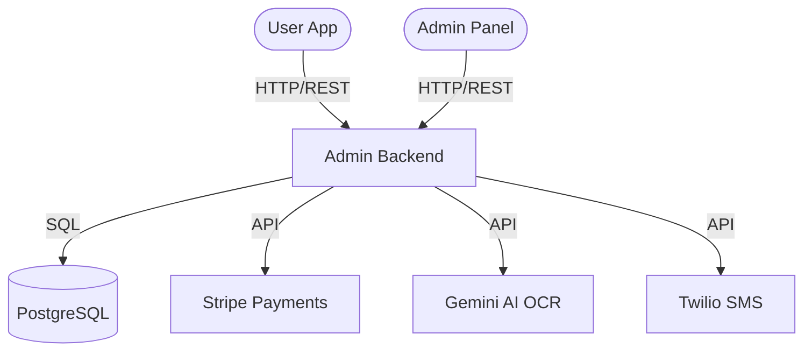

# About Solution

This document provides a detailed overview of the Fuel-Flow architecture, technology stack, and implementation details.

## Topology

The system follows a microservices-inspired architecture managed via Docker Compose:



- **PostgreSQL**: Stores users, vouchers, transactions, and session data.
- **Admin Backend**: Orchestrates business logic, handles OCR processing for voucher PDFs, and manages integrations.
- **Frontend Applications**: React-based SPAs for both administrators and end-users.

## File Structure

```text
Fuel-Flow/
├── admin-panel/
│   ├── backend/        # Node.js/Express API & OCR Logic
│   ├── frontend/       # React Admin Dashboard
│   └── database/       # Drizzle ORM Schema & Migrations
├── mobile-app/         # Capacitor/React Mobile Application
├── docker-compose.yml  # Container Orchestration
└── .env                # Environment Variables
```

## Tech Stack

### Backend
- **Framework**: Express.js
- **Language**: TypeScript
- **ORM**: Drizzle ORM
- **Authentication**: Passport.js (Local Strategy, Session-based)
- **Storage**: Multer for file uploads
- **OCR**: Google Gemini AI & `pdf-lib`, `pdfjs-dist`

### Frontend & Mobile
- **Core**: React 19
- **Build Tool**: Vite
- **Styling**: Tailwind CSS 4
- **State Management**: Zustand
- **Data Fetching**: TanStack Query (React Query)
- **Navigation**: Wouter
- **Mobile Bridge**: Capacitor 8

## Implementation Highlights

### OCR Processing
The system uses a sophisticated OCR pipeline to extract voucher data from PDF files. It leverages `pdfjs-dist` to render PDF pages into images, which are then processed by Google's Gemini AI to identify fuel types, dosages, and QR codes.

### Payment Integration
Stripe is integrated to handle secure payments for fuel vouchers. The backend manages Stripe customers, payment intents, and webhooks to ensure synchronization between payment status and voucher availability.

### Mobile Experience
The `mobile-app` is built as a Progressive Web App (PWA) wrapped with Capacitor, allowing for native features and distribution across Android and iOS platforms while maintaining a shared codebase with the web.
